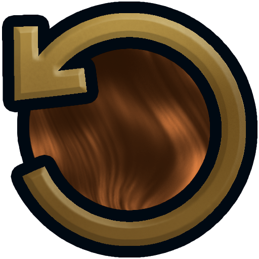
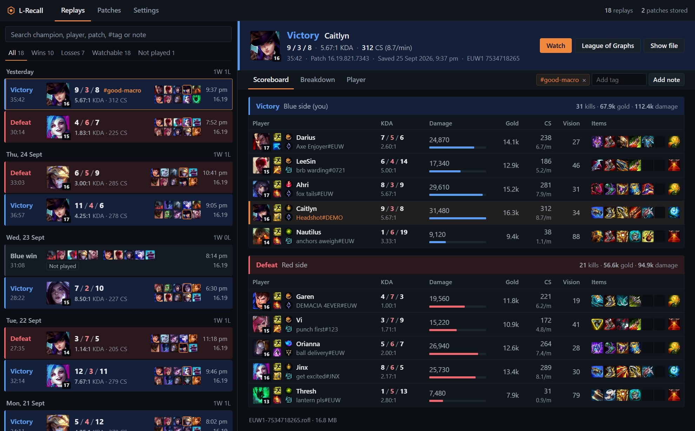

<p align="center">
  
</p>

<h1 align="center">L-Recall</h1>

<p align="center"><i>Watch your old League replays on the patch they were actually played on.</i></p>

<p align="center">
  <a href="https://github.com/EmberLynxe/L-Recall/actions/workflows/release.yml"></a>
  <a href="https://github.com/EmberLynxe/L-Recall/releases/latest"></a>
  <a href="https://github.com/EmberLynxe/L-Recall/releases"></a>
  <a href="LICENSE"></a>
  <a href="https://ko-fi.com/emberlynx_"></a>
</p>

<p align="center">
  <a href="https://github.com/EmberLynxe/L-Recall/releases/latest"><b>Download</b></a> ·
  <a href="#setup">Setup</a> ·
  <a href="#vanguard">Vanguard</a> ·
  <a href="#need-help">Need help?</a>
</p>



The League client only plays replays from the current patch, so every time the game updates, your old replays stop working. L-Recall keeps a copy of each patch you've had installed and launches the right one when you want to watch something. It's also a replay browser, so you can look through your games and their stats without opening the client.

It's new and so far it's only been run on my PC, so if it breaks on yours, [open an issue](https://github.com/EmberLynxe/L-Recall/issues).

## What it does

- Keeps a copy of every patch you have installed, automatically. It checks once an hour and saves the new patch after the Riot Client is done updating.
- Lists your replays by day, with results from your side of the game. Search by champion, player, patch, tag or note, or filter to wins, losses, watchable, or games you didn't play in.
- Shows the whole match: scoreboard with items, runes and spells, damage/gold/vision/healing/CC charts for all ten players, and a page per player with their runes and a pile of stats next to their lane opponent's.
- Tags and notes on any game. Search `#tag` to find them again.
- A League of Graphs button for every game.

It doesn't copy the whole game folder every patch. Most files don't change between patches, so each one is only stored once. The first patch is a full copy (around 25 to 30 GB), after that it's usually a few GB per patch. However, please keep in mind that the older the patch, the more differences there will be in terms of WAD file content.

For example, 4 patches back to back of the past year (16.19-16.15), should stay relatively in the 23-30GB region of size. Add in a patch from let's say 15.15, there's about 10GB that will need to be accounted for (Ionia SR vs Default SR)

## Setup

1. Grab the zip from [releases](https://github.com/EmberLynxe/L-Recall/releases/latest) and unzip it somewhere, like in your desktop as a folder or something lol.
2. Run `L-Recall.exe`. It finds your League install and replays folder on its own. Pick a folder with a decent amount of free space for storing patches.
3. Leave it running in the tray. It starts with Windows and grabs new patches after each update.

Replays are the `.rofl` files you get from the download button in match history.

> [!IMPORTANT]
> It can only save patches you actually had installed. If a patch was never on your PC, replays from it can't be played. The Patches tab shows which patches your replays need that you don't have yet, so start it early.
>
> The game files belong to Riot, so I can't share old patches or point you to places to get them. Please don't share your storage folder either. It's for your own replays on your own PC.

## Vanguard

L-Recall starts Riot's own game client with the replay file, the same way the client does when you hit watch. It checks whether Vanguard is running so it can warn you, but it never starts, stops or changes it.

- Replays from 14.9 on need Vanguard running (that's when it came out).
- If your PC uses [Pre-Check](https://support.riotgames.com/en-us/riot/performance/vanguard-pre-check), Vanguard only runs while a Riot game is open. If a newer replay won't open, start League from the Riot Client first.
- Older replays don't need it. They should still play with it on, but I haven't tested that much, so there's an optional warning. If one crashes, exit Vanguard from its tray icon ([Riot's FAQ](https://support.riotgames.com/en-us/league-of-legends/performance/riot-vanguard-faq-league-of-legends)). It comes back next restart.

Easiest is to just leave Vanguard on.

## Things to know

- Replay files don't store when the game started, so the date shown is when the file was saved.
- When there's a new version L-Recall tells you. Hit Update now and it updates itself, or grab the zip from [releases](https://github.com/EmberLynxe/L-Recall/releases/latest) and unzip it over the old one. Your settings and patches stay either way.
- Coming from League VCS? Point L-Recall at your old storage folder in Settings and hit Optimize on the Patches tab to shrink it. Anything that can't be checked against the original gets left alone.
- It only connects to two things: Riot's Data Dragon CDN for champion and item icons, and GitHub to check for new versions (you can turn that off in Settings). Nothing about you or your replays gets sent anywhere.

## What to expect

How heavy it is depends a lot on your PC, mostly your drive.

- **Disk space:** the first patch is a full copy, about 25 to 30 GB, and each patch after that usually adds a few GB. Patches kept ready to play take about 25 to 30 GB each on top of that (Settings > Starting replays).
- **Storing a new patch** happens in the background at low priority once the Riot Client has finished updating. It reads the whole game folder once, so expect some disk activity for a few minutes. It waits if you're in a game.
- **Watching a replay on a patch that isn't ready yet** means building that patch's game files first. On an NVMe SSD a full patch takes around a minute and a half. SATA SSDs take longer and hard drives a lot longer. The progress bar shows how long is left based on how fast it's actually going on your PC.
- **Going back to a patch that's kept ready** is instant.

## Uninstalling

Settings > Uninstall. It removes the startup entry, the icon cache, your settings and the program files, then closes. Stored patches stay unless you tick the box, so a later install can pick them up again. Your replay files are never touched.

## Need help?

Check the [issues](https://github.com/EmberLynxe/L-Recall/issues) to see if someone's hit the same thing, or open a new one. The log files next to `L-Recall.exe` (in `logs\`) help a lot if something went wrong.

## Building it yourself

Needs Python 3.14 on Windows.

```
python -m venv venv
venv\Scripts\pip install -r requirements.txt
venv\Scripts\python -m unittest discover -s tests
venv\Scripts\python entrypoints\main.py
```

`venv\Scripts\python build.py build_exe` builds the exe. Releases get built by GitHub Actions from tags.

## Code signing policy

Releases are built by GitHub Actions from tagged commits in this repo, never uploaded by hand.

- Committers and reviewers: [EmberLynxe](https://github.com/EmberLynxe)
- Approvers: [EmberLynxe](https://github.com/EmberLynxe)

Privacy: it only talks to Riot's Data Dragon (icons) and GitHub (update checks), both can be turned off in Settings, and nothing about you or your replays gets sent.

## Support

L-Recall is free and always will be. If it saved a replay you cared about and you feel like it, you can [buy me a coffee on Ko-fi](https://ko-fi.com/emberlynx_).

## Thanks

- [League VCS](https://github.com/preyneyv/league-vcs) by Pranav Nutalapati, which this is built on and which the icon comes from.
- [ReplayBook](https://github.com/fraxiinus/ReplayBook) by fraxiinus, for years of keeping replays usable and a lot of the inspiration for the replay browser side.
- Riot's [Data Dragon](https://developer.riotgames.com/docs/lol#data-dragon) for the champion, item and rune icons.

---

[MIT license](LICENSE)

L-Recall isn't endorsed by Riot Games and doesn't reflect the views or opinions of Riot Games or anyone officially involved in producing or managing Riot Games properties. Riot Games, and all associated properties are trademarks or registered trademarks of Riot Games, Inc.
