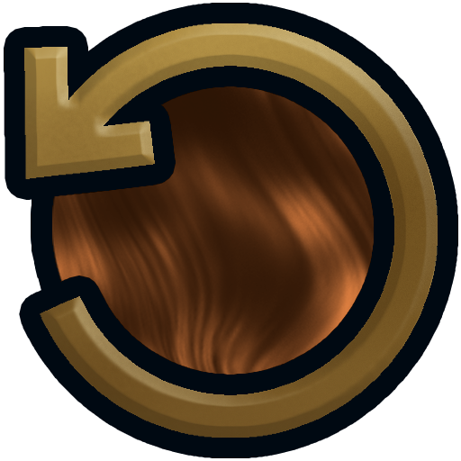
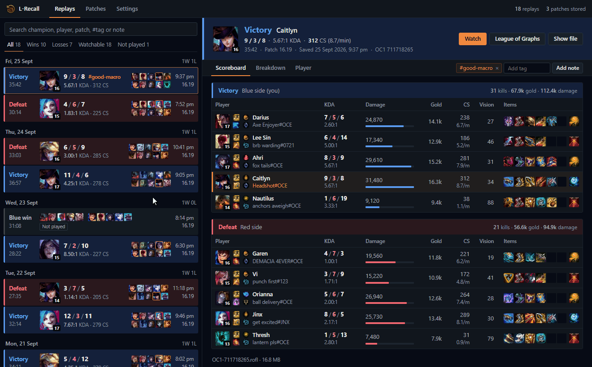

<p align="center">
  
</p>

<h1 align="center">L-Recall</h1>

<p align="center">A tool that sorts your old Client Patches, and the means to watch older ROFL/Game Replays.</p>

<p align="center">
  <a href="https://github.com/EmberLynxe/L-Recall/actions/workflows/release.yml"></a>
  <a href="LICENSE"></a>
  <a href="https://github.com/EmberLynxe/L-Recall/releases/latest"></a>
  <a href="https://ko-fi.com/emberlynx_"></a>
</p>

<p align="center">
  <a href="https://github.com/EmberLynxe/L-Recall/releases/latest"><b>Download for Windows</b></a>
  &nbsp;&middot;&nbsp;
  <a href="#getting-started">Getting started</a>
  &nbsp;&middot;&nbsp;
  <a href="#need-help">Need help?</a>
</p>

<p align="center">
  
</p>

The native League client is only able to play ROFL files from the same patch (Not including hotfixes iirc...), which means older replays from patches yonks ago dont work anymore... which is where this tool comes in to help.

L-Recall is a tool designed to automatically archive your patches as Riot updates them, allowing you to play older replays dynamically, depending on what patch is necessary to play them to begin with. It also happens to be great at sorting that messy replay folder of yours in a nice little program :)

> [!WARNING]
> It is absolutely HIGHLY RECOMMENDED, that you turn on Vanguard's [Pre-Check](https://support.riotgames.com/en-us/riot/performance/vanguard-pre-check) if you can. Without it Vanguard stays on all the time and blocks replays from opening, so you'd have to exit it from its tray icon before watching, then restart your PC before you play League again. L-Recall never touches Vanguard itself. Otherwise, you will have to resort to manually exiting the Vanguard process via the right clicking it's icon in the taskbar tray; with a restart being necessary should you want to play a Riot Game afterwards.

## Getting started

1. Download the zip from [releases](https://github.com/EmberLynxe/L-Recall/releases/latest) and unzip it somewhere, a folder on your desktop is fine.
2. Run `L-Recall.exe`. It finds League on its own, and your replays too if they're in the usual Documents folder. You just pick where the patches get saved.
3. Leave it running in the tray. It saves each new patch after League updates.

The first time you run it, Windows might say it protected your PC, because L-Recall isn't code signed yet (that costs money or needs a bigger project). Click **More info**, then **Run anyway**. The whole source is right here, and every release is built straight from it by GitHub.

It can only save patches that were actually on your PC, so the sooner it's running the better.

## How much space it takes

Patches share most of their files, and anything that's the same between them is only saved once. So how much space it takes depends on how far apart your patches are:

- A fully loaded native patch comes in around 20-28GB, this includes everything from the client itself, maps, champions, ALL of it
- The next patch usually only adds somewhere between 80 and 450 MB, depending on how much it changes. On my PC, 16.19 added 430 MB on top of 16.18, and a 16.19 hotfix added 81 MB.
- Patches further apart share less. 15.14 next to 16.18 is about 13 GB extra, most of it champion files that changed over the year, plus the maps.

To actually watch something, its patch has to be built and ready on top of the storage. By default only the champions and map in the replay get built, so that's around 6 GB for a Summoner's Rift game and a bit over 4 GB for ARAM or Arena, instead of a full 30 GB copy of the game. This is done by parsing the ROFL file for Champion data etc, and then telling the tool to ONLY load those Champions and other necessary files for that ROFL to load successfully. Please note that this feature is highly experimental and don't be surprised if this causes crashes or other weird issues with the tool. (If there are issues, the tool will automatically load the entire patch)

Only one patch is kept ready, and watching a replay from another patch updates it in place. You can turn that off or keep more patches ready in Settings, but each one takes a lot more space. If you'd rather not have anything sitting there between sessions, Clear ready files on the Patches tab gets that space back, or Settings can do it every time L-Recall closes.

It works out whether your storage is on an NVMe SSD, a SATA SSD or a hard drive, and builds patches the way that suits it. It's fastest on an NVMe, but a hard drive works fine too, especially after running Rearrange storage in Settings. However I highly recommend that this tool is used on SSD's only, as to take advantage of higher speeds, file multitasking, as this tool does a LOT of unpacking and repacking files.

The game files belong to Riot, so I can't share old patches, and please don't share your storage folder either.

Logo is taken from League VCS, and edited to be a dark Amber; idk, to represent Zhonya's stasis for patches :D

## Need help?

Check the [issues](https://github.com/EmberLynxe/L-Recall/issues) or open a new one. If something went wrong, **Save a problem report** at the bottom of Settings zips your last few logs into your Downloads folder, with your username taken out. Attaching that helps a lot.

## Building from source

You'll need Python 3.14 on Windows.

```
python -m venv venv
venv\Scripts\pip install -r requirements.txt
venv\Scripts\python entrypoints\main.py
```

`venv\Scripts\python build.py build_exe` builds the exe.

## Code signing policy

Releases are built by GitHub Actions from tagged commits in this repo, never uploaded by hand. Committer and approver: [EmberLynxe](https://github.com/EmberLynxe). The app only talks to Riot's Data Dragon (for icons) and GitHub (for update checks), and nothing about you or your replays gets sent anywhere.

## Thanks

[League VCS](https://github.com/preyneyv/league-vcs) by Pranav Nutalapati, which this is built on.

[ReplayBook](https://github.com/fraxiinus/ReplayBook) by fraxiinus, which inspired a lot of the replay browser.

Riot's [Data Dragon](https://developer.riotgames.com/docs/lol#data-dragon) for the champion, item and rune icons.

<sub>L-Recall isn't endorsed by Riot Games and doesn't reflect the views or opinions of Riot Games or anyone officially involved in producing or managing Riot Games properties. Riot Games, and all associated properties are trademarks or registered trademarks of Riot Games, Inc.</sub>
